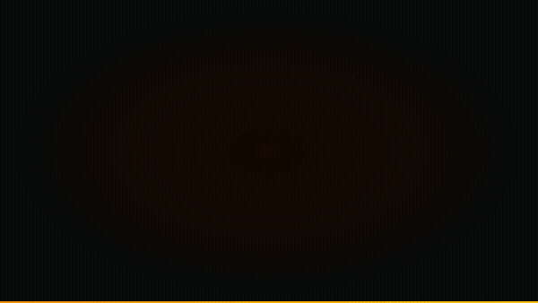

<div align="center">

# 🍟 감튀모임

### 동네 감자튀김 모임 지도

**동네별로 감튀 먹을 사람 모아주는 지도 앱 — 지역 선택 → 모임 생성 → 채팅까지 한 번에.**

[](https://fri-class.vercel.app)
[](https://nextjs.org)
[](https://supabase.com)
[](https://fri-class.vercel.app)



> 📺 **[원본 영상 보기 (MP4)](media/promo.mp4)** &nbsp;·&nbsp; 🍟 **[지금 사용하기](https://fri-class.vercel.app)**

</div>

---

## 🗺️ 사용 방법

1. **[fri-class.vercel.app](https://fri-class.vercel.app)** 접속
2. **지도에서 시도 클릭** → 시군구 클릭 → 동 클릭
3. **모임 만들기** — 날짜/시간과 한줄 메모 입력 후 등록
4. **참여** — 기존 모임에 "나도 갈게요 🍟" 누르기
5. **채팅** — 같은 모임 참여자들과 실시간 대화

---

## ✨ 주요 기능

- 🗺️ **드릴다운 지도** — 전국 → 시도 → 시군구 → 동 단계별 확대
- 📍 **내 위치 찾기** — GPS로 현재 위치의 동까지 자동 이동
- 🍟 **모임 생성/참여** — 동 단위로 모임 개설, 인원 집계
- 💬 **채팅** — 모임별 실시간 채팅 (5초 폴링)
- 🔗 **딥링크 공유** — 특정 동 링크를 공유하면 바로 해당 동으로 이동
- 📊 **모임 밀도 표시** — 모임 수에 따라 동 색상이 달라짐

---

## 🛠️ 기술 스택

| 레이어 | 도구 |
|---|---|
| **프레임워크** | [Next.js 16.2.4](https://nextjs.org) (App Router) |
| **지도** | [react-simple-maps](https://www.react-simple-maps.io) + D3-geo |
| **지도 데이터** | 한국 행정구역 경계 GeoJSON (시도 / 시군구 / 읍면동) |
| **데이터베이스** | [Supabase](https://supabase.com) (PostgreSQL + RLS) |
| **스타일** | Tailwind CSS v4 |
| **배포** | [Vercel](https://vercel.com) |
| **패키지 매니저** | [Bun](https://bun.sh) |

---

## 🚀 로컬 실행

```bash
git clone https://github.com/LeoOH5/FriClass.git
cd FriClass
bun install
```

`.env.local` 파일 생성:

```env
NEXT_PUBLIC_SUPABASE_URL=your_supabase_url
NEXT_PUBLIC_SUPABASE_ANON_KEY=your_supabase_anon_key
```

Supabase에서 스키마 실행 (`supabase-schema.sql`), 그 다음:

```bash
bun dev
```

→ [http://localhost:3001](http://localhost:3001)

---

## 🗄️ 데이터베이스 스키마

```
gatherings      — 모임 (동 코드, 생성자, 메모, 날짜)
participants    — 참여자 (gathering_id, user_uuid)
messages        — 채팅 메시지 (gathering_id, user_uuid, message)
```

모든 테이블 RLS 활성화 — 누구나 읽기/쓰기 가능 (익명 참여 모델).

---

## 📁 프로젝트 구조

```
fri-class/
├── src/
│   ├── app/
│   │   ├── api/
│   │   │   ├── gatherings/        ← 모임 CRUD
│   │   │   │   ├── [id]/
│   │   │   │   │   └── messages/  ← 채팅 API
│   │   │   │   └── counts/        ← 동별 모임 수
│   │   │   └── participants/      ← 참여 API
│   │   └── page.tsx
│   ├── components/
│   │   ├── KoreaMap.tsx           ← 드릴다운 지도
│   │   └── GatheringModal.tsx     ← 모임 목록 + 채팅
│   └── lib/
│       ├── supabase.ts
│       └── store.ts
├── public/geo/                    ← 행정구역 GeoJSON (277개)
├── media/
│   └── promo.mp4
└── supabase-schema.sql
```

---

## 📜 라이선스

MIT

---

<div align="center">

**Made with 🍟 by [@LeoOH5](https://github.com/LeoOH5)**

[](https://fri-class.vercel.app)

</div>
